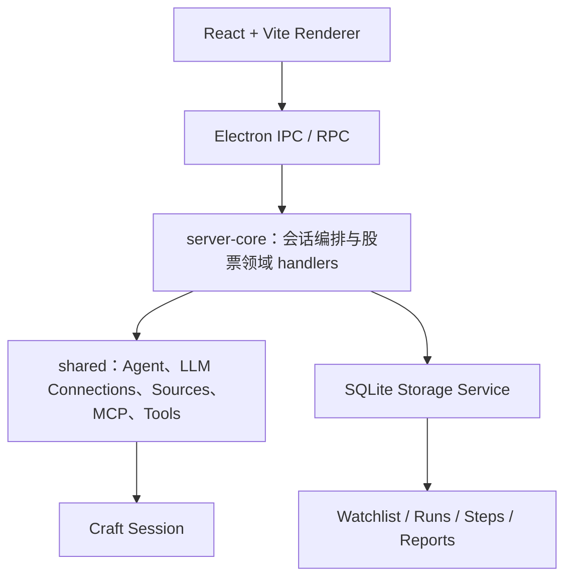

<div align="center">

# StockCraft

基于 AI Agent 的本地股票研究桌面工作台，支持 A 股、港股和美股的五步研究流程。

[](LICENSE)


**当前状态：开发预览版，可本地运行。**

</div>

StockCraft 围绕单只股票组织可追溯的研究过程：从数据收集、观点分析和牛熊辩论，到风险审查与最终报告生成。每次研究都关联一个 Agent 会话，研究步骤与报告保存在本地，方便继续追问、历史复盘和导出。

项目不是实时行情终端，也不提供券商接入或自动交易。

## 核心功能

### 五步股票研究

输入股票代码后，StockCraft 会创建一个独立研究会话，并组织以下流程：

1. **数据收集**：整理公司信息、财报、新闻、估值和行业背景。
2. **分析师观点**：从基本面、估值、行业和事件驱动等角度形成观点。
3. **牛熊辩论**：围绕核心分歧构建看多与看空论点。
4. **风险审查**：检查市场、财务、监管、治理、流动性和数据质量风险。
5. **报告生成**：输出带有结论、依据、风险和免责声明的研究报告。

当前支持的代码类型包括：

- A 股，例如 `600519`、`600519.SH`
- 港股，例如 `00700.HK`
- 美股，例如 `AAPL`、`TSLA`

### Watchlist

- 添加 A 股、港股和美股。
- 按分组管理自选股。
- 搜索股票、分组和备注。
- 编辑分组与备注。
- 删除前确认。
- 从自选股直接发起研究。

### Reports

- 浏览历史研究报告。
- 按股票和风险等级筛选。
- 查看完整报告内容和免责声明。
- 返回报告关联的原始 Agent 会话。
- 导出 Markdown 文件。

### 本地持久化

StockCraft 使用本地 SQLite 保存：

- Watchlist 条目。
- 研究 run 与关联会话。
- 五步研究结果。
- 最终研究报告。

研究完成后会自动保存步骤和报告。如果解析或写入失败，原会话会显示重试入口；现有回复仍不完整时，可以让 Agent 在原会话中重新生成规范报告。

Renderer 不直接访问 SQLite，所有数据操作都经过 Electron IPC / RPC 和服务层。

### 独立的开发实例

`bun run electron:dev` 启动的是隔离的 **StockCraft Dev** 实例：

| 边界 | StockCraft Dev | 已安装的 Craft Agents |
| --- | --- | --- |
| 配置目录 | `~/.stockcraft-dev` | `~/.craft-agent` |
| Electron userData | `StockCraft Dev` | `Craft Agents` |
| Deep Link | `stockcraft-dev://` | `craftagents://` |
| SQLite、日志与锁 | 独立 | 独立 |

两者可以同时运行，不会共享配置、会话、凭据、数据库、缓存、日志或单实例锁。

## 使用流程

1. 在设置中配置可用的 LLM connection。
2. 创建或选择一个 workspace。
3. 点击侧栏的 **Stock Research**，输入股票代码；也可以从 Watchlist 发起研究。
4. 在研究会话顶部查看五步进度，并在会话中继续追问。
5. 打开 **Reports** 查看、筛选或导出已保存的报告。

股票数据质量取决于当前 workspace 配置的 Sources、MCP 服务和其他可用工具。

## 本地运行

### 前置条件

- Git
- [Bun](https://bun.sh/) 1.3.x；仓库当前验证版本为 `1.3.10`
- Windows 开发建议使用 PowerShell

当前 GitHub 仓库名仍是 `TradingAgents`，产品名为 **StockCraft**。

### Windows

```powershell
git clone https://github.com/fuweiwe1/TradingAgents.git
cd TradingAgents
bun install --frozen-lockfile
powershell -NoProfile -ExecutionPolicy Bypass -File .\init.ps1
bun run electron:dev
```

`init.ps1` 会检查必需的持久化文件、验证 `feature_list.json`，并显示当前仓库和 Bun 工作区状态。

### macOS / Linux / Git Bash

```bash
git clone https://github.com/fuweiwe1/TradingAgents.git
cd TradingAgents
bun install --frozen-lockfile
bash ./init.sh
bun run electron:dev
```

如果 Windows 上的 WSL 缺少 `/bin/bash`，请使用 PowerShell 的 `init.ps1`。

## 常用命令

| 命令 | 用途 |
| --- | --- |
| `bun run electron:dev` | 启动隔离的 StockCraft Dev |
| `bun run typecheck:shared` | 检查 shared 包类型 |
| `bun run typecheck:all` | 检查主要 workspace 类型 |
| `bun run lint:instance-paths` | 检查生产路径是否错误写入原版目录 |
| `bun run lint:i18n:sorted` | 检查国际化键排序 |
| `bun run lint:i18n:parity` | 检查各语言键是否一致 |
| `bun run electron:build` | 构建 Electron 主进程、preload、renderer 和资源 |
| `bun run electron:dist:stockcraft-dev:win` | 构建 Windows StockCraft Dev 发行包 |

完整脚本请查看 [`package.json`](package.json)。

## 技术架构

StockCraft 保留 Craft Agents OSS 的分层方式，在现有 Agent 平台上增加股票研究领域能力：



- **Electron**：桌面窗口、系统集成、IPC 和本地运行时。
- **React + Vite**：Stock Research、Watchlist、Reports 和会话界面。
- **server-core**：RPC、研究 run、持久化协调和会话关联。
- **shared**：Agent、LLM connections、Sources、MCP、协议与股票共享契约。
- **SQLite**：Electron 使用其 Node 运行时的 `node:sqlite` 适配器，Bun headless server 使用 `bun:sqlite` 适配器。

每次股票研究继续使用一个标准 Craft session，不会绕过现有会话与 LLM connection 系统创建另一套 Agent runtime。

## 项目目录

```text
apps/electron/       Electron 主进程、preload 和 React renderer
packages/shared/     Agent、配置、协议、Sources、MCP 与股票共享类型
packages/server-core RPC handlers、会话编排和股票存储服务
packages/server/     Headless server
docs/specs/          StockCraft 产品与技术规格
docs/superpowers/    已批准的设计与实施计划
scripts/             构建、开发、校验和实例隔离脚本
```

项目工作流与当前功能证据分别记录在：

- [`AGENTS.md`](AGENTS.md)
- [`feature_list.json`](feature_list.json)
- [`claude-progress.md`](claude-progress.md)
- [`docs/specs/stockcraft-v1-spec.md`](docs/specs/stockcraft-v1-spec.md)

## 项目基础

StockCraft 基于 [Craft Agents OSS](https://github.com/craft-ai-agents/craft-agents-oss) `v0.10.3` 代码基线进行垂直改造，并保留其 Agent 会话、LLM connection、Sources、MCP、权限系统和桌面基础能力。

本仓库新增的主要方向是：

- 面向 A 股、港股和美股的五步研究流程。
- Stock Research 工作入口与步骤状态。
- Watchlist 与 Reports。
- 研究步骤和报告的本地自动持久化。
- 与已安装 Craft Agents 完全隔离的 StockCraft Dev 实例。

感谢 Craft Agents OSS 项目及其贡献者提供的开源基础。

## 当前状态与限制

- 当前为开发预览版，核心 StockCraft v1 流程已具备自动化验证和 Windows 本地运行证据。
- 尚未提供稳定版下载、自动更新或正式发布承诺。
- 股票研究所使用的数据依赖用户配置的 Sources、MCP 和工具，项目本身不保证数据完整性、实时性或准确性。
- 不提供实时盘口、自动交易、券商账户接入、投资组合自动调仓或收益保证。
- Electron 当前使用的 Node 22 `node:sqlite` API 仍会输出实验性功能警告。

## 投资免责声明

> **StockCraft 生成的内容仅供学习与研究，不构成投资建议、交易建议或收益承诺。使用者应独立核实数据并自行承担决策风险。**

## 许可证

本项目采用 [Apache License 2.0](LICENSE)。

使用、修改或分发本项目时，也请遵守仓库中的 [`NOTICE`](NOTICE) 和 [`TRADEMARK.md`](TRADEMARK.md)。
