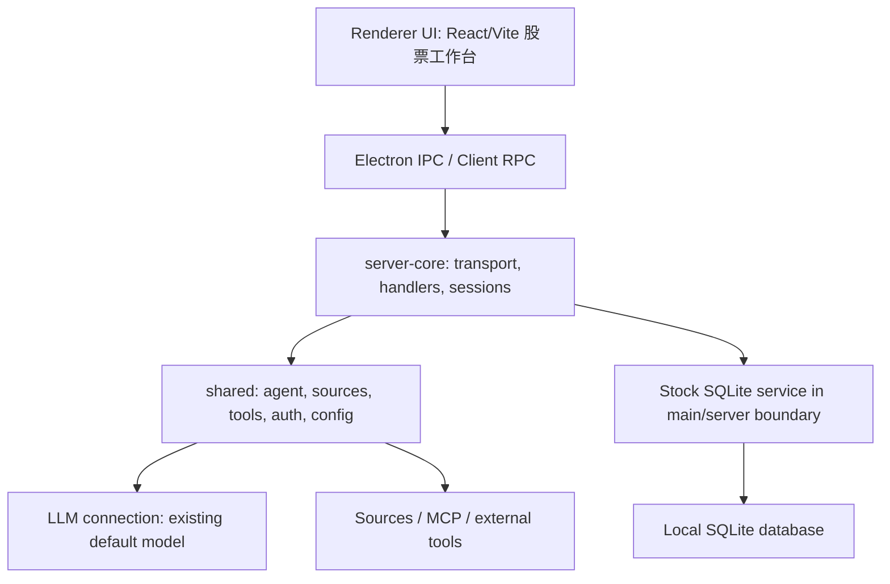

# StockCraft v1 Spec

## 1. 项目定位

StockCraft 是基于 Craft Agents OSS 的股票研究桌面工作台。它不是重写一个新的 Agent 平台，而是在 Craft Agents 既有桌面端、会话、LLM connection、Source、MCP 和工具体系上，新增一个垂直的股票研究场景。

v1 的核心目标是：用户输入一只股票后，系统围绕该标的创建一次可追溯的研究流程，自动组织数据收集、分析师观点、牛熊辩论、风险审查和报告生成，最后沉淀为本地可检索的研究报告。

## 2. 目标用户

- 个人投资研究者。
- 需要跨 A 股、港股、美股做基本面、新闻、财报、估值和风险梳理的用户。
- 希望保留研究过程、复盘历史观点、从报告跳回原始会话的用户。

## 3. v1 范围

### 3.1 In Scope

- 单股研究流程。
- A 股、港股、美股标的识别。
- 五步研究流：
  1. 数据收集
  2. 分析师观点
  3. 牛熊辩论
  4. 风险审查
  5. 报告生成
- 每一次单股研究对应一个 Craft session。
- 复用 Craft Agents 现有 LLM connection 系统。
- v1 只使用单连接默认模型，不新增多 provider 路由系统。
- 新增股票研究工作台 UI。
- 新增本地 SQLite 存储，用于 Watchlist、研究 run、步骤结果和报告。
- 新增 Reports 中心。
- 新增轻量 Watchlist。
- 数据接入优先通过 Craft Agents Source / MCP / 工具能力暴露给 Agent。

### 3.2 Out of Scope

- 自动交易、下单、券商账户接入。
- 实时行情盘口。
- 高频交易策略。
- 投资组合自动调仓。
- 多模型投票系统。
- 重造 LLM provider、API key、连接管理系统。
- 云端多用户同步。
- 付费订阅、团队权限、后台管理系统。

## 4. 技术栈基线

以 Craft Agents OSS 当前技术栈为基础：

| 层级 | 技术 | 作用 |
| --- | --- | --- |
| 运行时与包管理 | Bun | 工作区管理、脚本执行、子进程生成 |
| 桌面框架 | Electron | 原生窗口、IPC、操作系统集成 |
| 渲染器 | React 18 + Vite | UI 渲染、状态管理、样式定制 |
| Agent SDK | `@anthropic-ai/claude-agent-sdk` | Claude 模型与原生工具执行 |
| 多提供商 Agent SDK | `@mariozechner/pi-coding-agent` | 既有多提供商子进程能力，不在 v1 重造 |
| MCP 集成 | `@modelcontextprotocol/sdk` | Source、工具协议和外部能力接入 |
| 富文本 | TipTap 3 | Markdown、代码块、公式等富文本展示 |
| 错误追踪 | Sentry | 生产环境错误报告 |
| 国际化 | i18next | 多语言支持 |
| 构建工具 | esbuild、electron-builder | 打包与分发 |
| 本地存储新增 | SQLite + `better-sqlite3` | 股票研究数据持久化 |

## 5. 分层架构

StockCraft 保持 Craft Agents 的分层方式，只新增股票域模块，不打穿原有边界。

### 5.1 客户端层

新增股票研究工作台页面，保留 Craft Agents 原有会话入口。

主要 UI：

- 股票搜索 / 输入框。
- 研究步骤流。
- 当前研究会话视图。
- 报告中心。
- Watchlist。

职责：

- 展示状态。
- 发起研究请求。
- 展示 step progress、报告和历史记录。
- 不直接访问 SQLite。
- 不直接调用 LLM provider。

### 5.2 宿主与运行时层

Electron main 继续负责：

- 桌面窗口。
- IPC 桥接。
- 本地文件、系统能力。
- 本地 SQLite 连接生命周期。

如果未来启用 headless server，也应复用 `server-core`，不要把股票研究逻辑绑死在 Electron main。

### 5.3 RPC / 会话编排层

继续复用 Craft Agents 的 `server-core`：

- transport。
- handlers。
- sessions。
- bootstrap。
- session event 流。

StockCraft 新增 handler 时，应只暴露领域动作，例如：

- `stockResearch.createRun`
- `stockResearch.getRun`
- `stockResearch.listReports`
- `stockResearch.openReport`
- `watchlist.add`
- `watchlist.remove`

### 5.4 Agent 业务层

复用 Craft Agents `shared` 中的 agent、sources、skills、tools、config、auth 能力。

新增股票域的核心编排：

- 标的解析。
- 研究 run 状态机。
- 五步研究提示词/任务描述。
- Source 工具选择。
- 报告结构化生成。
- 免责声明注入。

该层可以调用现有 Agent 能力，但不应该绕过 Craft session 机制直接开一套孤立 Agent runtime。

### 5.5 基础契约层

保留 Craft Agents `core` / `session-tools-core` 的角色：

- 稳定类型。
- 消息协议。
- 工具定义。
- 跨端共享契约。

股票模块新增类型时，应优先放在与原有分层一致的位置：

- UI 专用类型留在 UI 附近。
- IPC/RPC 契约类型放在共享 contract 位置。
- Agent 内部实现类型留在股票 agent 模块内部。

### 5.6 外部接入层

股票数据优先通过 Source / MCP / tool adapters 接入。

v1 可支持的 Source 模板：

- 财报数据源。
- 新闻数据源。
- 公告数据源。
- 行情摘要数据源。
- 估值指标数据源。

这些 Source 是 Agent 的可调用能力，不应该让 renderer 直接拼接外部数据。

## 6. LLM 策略

### 6.1 原则

复用 Craft Agents 现有 LLM connection 系统。StockCraft v1 不新增 provider registry、不新增 API key 管理、不新增模型路由器。

### 6.2 单连接默认模型

v1 使用“单连接默认模型”策略：

- 用户在 Craft Agents 既有设置中配置可用 LLM connection。
- 股票研究流程读取当前默认连接和默认模型。
- 五步研究流全部使用该默认模型。
- 如果没有可用默认模型，UI 提示用户先完成模型连接设置。

### 6.3 暂不实现 ResearchModelPolicy

此前讨论过 `ResearchModelPolicy`，它的含义是“研究任务如何选择模型的策略对象”。v1 不需要抽象成独立策略层。

当前实现边界：

- 只需要一个 `getDefaultResearchModel()` 或等价 adapter。
- 它只读取现有 LLM connection 默认值。
- 不做 fallback、不做多模型分工、不做成本路由。

未来可以在 v2 引入：

- 快速模型用于数据整理。
- 强模型用于深度推理。
- 便宜模型用于摘要。
- provider fallback。

## 7. 数据存储

### 7.1 存储技术

使用 SQLite + `better-sqlite3`。数据库由 Electron main 或 server boundary 管理，renderer 只能通过 IPC/RPC 访问。

### 7.2 表设计草案

#### `stock_symbols`

- `id`
- `symbol`
- `market`
- `name`
- `currency`
- `created_at`
- `updated_at`

#### `watchlist_items`

- `id`
- `symbol_id`
- `group_name`
- `note`
- `created_at`
- `updated_at`

#### `research_runs`

- `id`
- `session_id`
- `symbol_id`
- `status`
- `started_at`
- `completed_at`
- `error_message`
- `created_at`
- `updated_at`

#### `research_steps`

- `id`
- `run_id`
- `step_key`
- `status`
- `input_json`
- `output_markdown`
- `output_json`
- `started_at`
- `completed_at`
- `created_at`
- `updated_at`

#### `research_reports`

- `id`
- `run_id`
- `title`
- `symbol_snapshot_json`
- `rating`
- `risk_level`
- `summary`
- `content_markdown`
- `created_at`
- `updated_at`

### 7.3 边界规则

- renderer 不直接访问 SQLite。
- 数据库 schema 初始化在 main/server boundary。
- 数据查询通过 typed handler 暴露。
- 报告 Markdown 存在 SQLite 中，后续可加文件导出。
- 研究 run 必须保存关联 Craft session id。

## 8. 单股研究流程

### 8.1 输入

用户可以输入：

- `600519`
- `600519.SH`
- `00700.HK`
- `AAPL`
- `TSLA`

系统需要解析：

- symbol。
- market。
- display name。
- currency。

### 8.2 流程状态

研究 run 状态：

- `created`
- `running`
- `completed`
- `failed`
- `cancelled`

研究 step 状态：

- `pending`
- `running`
- `completed`
- `failed`
- `skipped`

### 8.3 五步说明

#### Step 1: 数据收集

目标：收集公司基本信息、近期新闻、财报摘要、关键指标、行业背景。

输出：

- 数据来源列表。
- 关键事实列表。
- 不确定或缺失数据提示。

#### Step 2: 分析师观点

目标：模拟多位分析师视角，包括基本面、估值、行业、事件驱动。

输出：

- 看多理由。
- 看空理由。
- 中性观察。
- 关键分歧点。

#### Step 3: 牛熊辩论

目标：组织 bull / bear 两方围绕核心分歧辩论。

输出：

- bull thesis。
- bear thesis。
- 双方反驳。
- 尚未解决的问题。

#### Step 4: 风险审查

目标：从市场、财务、监管、治理、流动性、数据质量角度审查风险。

输出：

- 风险清单。
- 风险等级。
- 触发条件。
- 需要继续跟踪的信号。

#### Step 5: 报告生成

目标：生成最终研究报告。

报告章节：

- 标题。
- 股票信息。
- 一句话结论。
- 核心观点。
- 关键事实。
- 牛熊分歧。
- 风险因素。
- 后续观察指标。
- 免责声明。

## 9. UI 信息架构

### 9.1 主布局

采用“研究步骤流为主，会话辅助”的 B 方案：

- 左侧：Watchlist / 历史研究。
- 中央：当前股票研究步骤流和报告预览。
- 右侧：关联 Craft session 或上下文事件。

### 9.2 主要页面

- Research Workbench：发起和查看当前研究。
- Reports：历史报告中心。
- Watchlist：自选股。
- Settings：复用 Craft Agents 原有 LLM / Source 设置。

### 9.3 UI 原则

- 不做营销 landing page。
- 第一屏就是可用工作台。
- 操作密度适合重复研究。
- 报告内容强调可读性和可追溯性。
- 所有投资相关输出都必须包含免责声明。

## 10. 验收标准

### 10.1 Spec 验收

- Spec 明确 v1 范围和 out-of-scope。
- Spec 明确复用 Craft Agents 现有 LLM connection 系统，只使用单连接默认模型。
- Spec 明确 SQLite 存储边界和 renderer/main 访问边界。
- Spec 明确五步研究流与单 Craft session 的关系。

### 10.2 Infra 验收

- 当前目录是 git 仓库。
- `origin` 指向用户 GitHub 仓库。
- `upstream` 指向 Craft Agents OSS 仓库。
- 当前仓库包含 Craft Agents OSS 代码基线。
- `package.json` 存在。
- `git log --oneline -5` 可运行。
- Windows 启动入口 `init.ps1` 可运行。
- 如果 Bun 可用，至少能运行 `bun install --frozen-lockfile` 或记录无法运行原因。

### 10.3 后续实现验收

- 输入 `600519` 可创建 A 股研究 run。
- 输入 `00700.HK` 可创建港股研究 run。
- 输入 `AAPL` 可创建美股研究 run。
- 每个 research run 关联一个 Craft session。
- 报告可保存并在 Reports 中打开。
- renderer 不直接访问 SQLite。

## 11. 风险与开放问题

- 当前 GitHub 仓库名是 `TradingAgents`，需要确认是否作为最终产品仓库名。
- Craft Agents OSS 上游可能快速变化，接入后需要保留 `upstream` remote 方便同步。
- 股票数据源质量会直接影响报告质量，v1 必须在报告中标注数据不确定性。
- 投资建议合规风险高，UI 和报告必须明确“仅供研究，不构成投资建议”。
- A 股、港股、美股代码解析规则不同，不能只用一个简单正则覆盖所有情况。

## 12. 后续实施顺序

1. 合入 Craft Agents OSS 代码基线。
2. 更新 `init.ps1` / `init.sh`，让它们识别真实 Bun workspace。
3. 在现有分层中定位 LLM connection 默认模型读取路径。
4. 设计股票域 IPC/RPC contract。
5. 实现 SQLite schema 和 main/server boundary。
6. 实现研究 run 状态机。
7. 实现 Research Workbench UI。
8. 实现 Reports 和 Watchlist。
9. 补充 smoke tests 和端到端检查。
